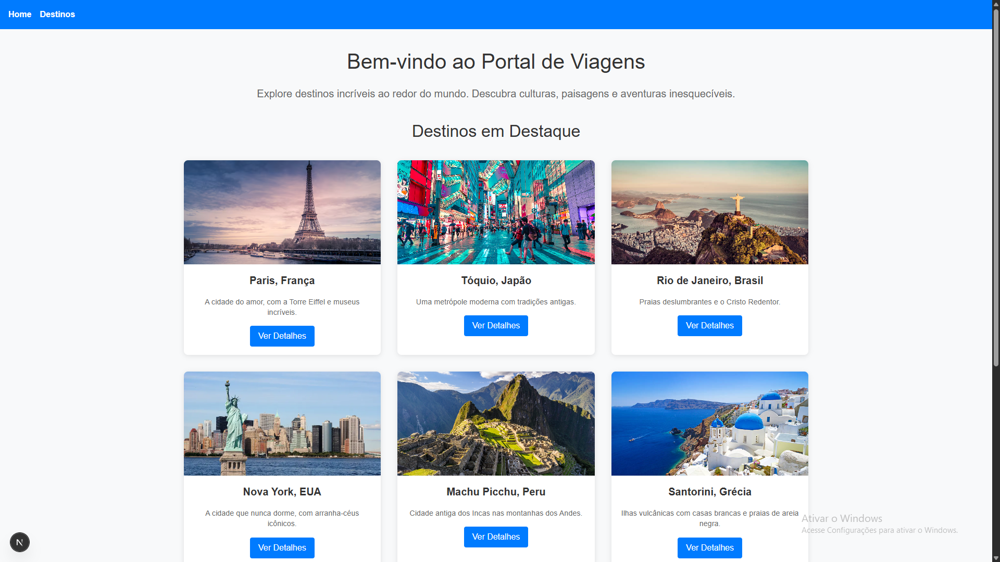

# Portal de Viagens

Um portal interativo de viagens desenvolvido com Next.js, apresentando destinos turísticos ao redor do mundo. Explore informações detalhadas sobre locais fascinantes, curiosidades, atrações e recomendações culinárias.

## � Preview



## �🚀 Funcionalidades

- **Página Inicial**: Apresentação do portal com destaques de destinos.
- **Listagem de Destinos**: Visualização de todos os destinos disponíveis em cards responsivos.
- **Páginas Detalhadas**: Informações completas sobre cada destino, incluindo:
  - Curiosidades locais
  - Locais para visitar
  - Restaurantes recomendados
- **Navegação Intuitiva**: Menu de navegação consistente em todas as páginas.
- **Design Responsivo**: Interface otimizada para desktop e dispositivos móveis.
- **Rotas Baseadas em Arquivos**: Estrutura organizada com rotas dinâmicas e estáticas.

## 🛠️ Tecnologias Utilizadas

- **Next.js 16.1.1**: Framework React para aplicações web.
- **React 19.2.3**: Biblioteca para construção de interfaces.
- **TypeScript**: Tipagem estática para maior robustez.
- **Tailwind CSS 4**: Framework CSS para estilização rápida e responsiva.
- **CSS Modules**: Estilização modular e scoped.

## 📦 Instalação e Execução

### Pré-requisitos

- Node.js (versão 18 ou superior)
- npm, yarn, pnpm ou bun

### Passos para Execução

1. **Clone o repositório**:
   ```bash
   git clone https://github.com/seu-usuario/portal-viagens.git
   cd portal-viagens
   ```

2. **Instale as dependências**:
   ```bash
   npm install
   # ou
   yarn install
   # ou
   pnpm install
   ```

3. **Execute o servidor de desenvolvimento**:
   ```bash
   npm run dev
   # ou
   yarn dev
   # ou
   pnpm dev
   ```

4. **Acesse a aplicação**:
   Abra [http://localhost:3000](http://localhost:3000) no seu navegador.

## 📁 Estrutura do Projeto

```
viagens/
├── app/
│   ├── components/
│   │   ├── CardDestino.tsx
│   │   ├── Layout.tsx
│   │   └── ...
│   ├── data/
│   │   └── destinos.ts
│   ├── destinos/
│   │   ├── [id]/
│   │   │   └── page.tsx
│   │   ├── 1/page.tsx
│   │   ├── 2/page.tsx
│   │   └── ...
│   ├── globals.css
│   ├── layout.tsx
│   └── page.tsx
├── public/
├── package.json
├── tailwind.config.js
└── README.md
```

## 🎯 Conceitos Aplicados

- **Rotas Baseadas em Arquivos**: Estrutura de pastas define as rotas automaticamente.
- **Rotas Dinâmicas**: Uso de `[id]` para páginas parametrizadas.
- **Componentes Reutilizáveis**: Layout, cards e seções modulares.
- **CSS Modules**: Estilização isolada e manutenível.
- **TypeScript**: Tipagem forte para melhor desenvolvimento.

## 🌍 Destinos Disponíveis

Atualmente, o portal apresenta 9 destinos incríveis:

1. Paris, França
2. Tóquio, Japão
3. Rio de Janeiro, Brasil
4. Nova York, EUA
5. Machu Picchu, Peru
6. Santorini, Grécia
7. Dubai, Emirados Árabes Unidos
8. Bali, Indonésia
9. Toronto, Canadá

## 🤝 Contribuição

Contribuições são bem-vindas! Siga estes passos:

1. Fork o projeto
2. Crie uma branch para sua feature (`git checkout -b feature/nova-feature`)
3. Commit suas mudanças (`git commit -m 'Adiciona nova feature'`)
4. Push para a branch (`git push origin feature/nova-feature`)
5. Abra um Pull Request

## 📄 Licença

Este projeto está sob a licença MIT. Veja o arquivo [LICENSE](LICENSE) para mais detalhes.


Desenvolvido com ❤️ usando Next.js
